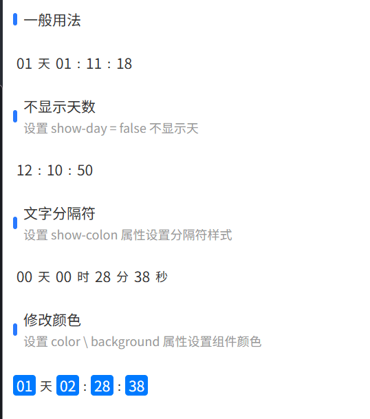

#### Countdown 倒计时组件

author: 孔德忠

倒计时组件，用于展示一个倒计时，例如活动结束时间、验证码有效期等。

#### 预览效果



#### 组件路径
> **组件已经全局注册过，无须再次引入**

`@/components/eqds/uni/uni-countdown/uni-countdown`

#### 基础用法

```vue
<uni-countdown :day="1" :hour="1" :minute="12" :second="40" />
```

#### API 参数

##### Props

| 参数名          | 说明                                           | 类型      | 默认值  | 是否必填 |
| --------------- | ---------------------------------------------- | --------- | ------- | -------- |
| timestamp       | 目标时间戳（秒），设置此值会忽略 day, hour, minute, second | `Number`  | `0`     | 否       |
| day             | 天数                                           | `Number`  | `0`     | 否       |
| hour            | 小时                                           | `Number`  | `0`     | 否       |
| minute          | 分钟                                           | `Number`  | `0`     | 否       |
| second          | 秒                                             | `Number`  | `0`     | 否       |
| show-day        | 是否显示天数                                   | `Boolean` | `true`  | 否       |
| show-colon      | 是否以冒号为分隔符                             | `Boolean` | `true`  | 否       |
| start           | 是否自动开始倒计时                             | `Boolean` | `true`  | 否       |
| background-color| 背景色                                         | `String`  | `''`    | 否       |
| color           | 文字颜色                                       | `String`  | `'#333'`| 否       |
| font-size       | 字体大小，单位px                               | `Number`  | `14`    | 否       |
| splitor-color   | 分割符号颜色                                   | `String`  | `'#333'`| 否       |

##### Events

| 事件名 | 说明               | 回调参数 |
| ------ | ------------------ | -------- |
| timeup | 倒计时时间到触发事件 | -        |

##### Methods

| 方法名 | 说明                                       | 参数 |
| ------ | ------------------------------------------ | ---- |
| update | 手动更新倒计时，适用于动态修改倒计时长后 | -    |
