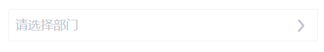
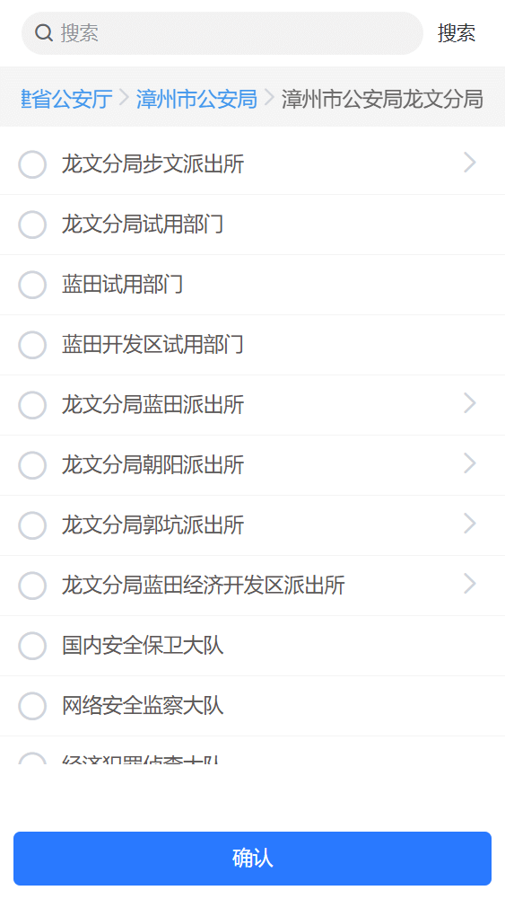

#### 部门选择器

author: 孔德忠

#### 组件路径

`@/components/eqds/k-form/k-select-depart/k-select-depart`

> **组件已经全局注册过，无须再次引入**

#### API (Props)

| 参数             | 说明                                                   | 类型    | 默认值       | 是否必填 |
| ---------------- | ------------------------------------------------------ | ------- | ------------ | -------- |
| v-model / value  | 绑定的值，即所选部门的 ID。多个值用逗号`,`分隔         | String  | null         | 否       |
| multi            | 是否支持多选                                           | Boolean | true         | 否       |
| disable          | 是否禁用选择器                                         | Boolean | false        | 否       |
| placeholder      | 输入框的提示文字                                       | String  | -            | 否       |
| border           | 是否显示输入框的边框                                   | Boolean | false        | 否       |
| orgCategory      | 根据机构类型过滤部门，多个类型用`,`分隔 (如 `'1,4'`)   | String  | ' '          | 否       |
| showSelectedOnly | 是否只显示最终选中的部门名称，否则显示完整的层级路径   | Boolean | false        | 否       |
| disablePadding   | 禁用状态下，文字是否移除上下内边距（用于文本展示场景） | Boolean | false        | 否       |
| valueKey         | 指定作为 v-model 值的字段名                            | String  | 'value'      | 否       |
| textKey          | 指定作为显示文本的字段名                               | String  | 'departName' | 否       |

#### Events (事件)

| 事件名          | 说明                                     | 回调参数                   |
| --------------- | ---------------------------------------- | -------------------------- |
| change          | 选中值改变时触发，返回选中的节点对象数组 | (list): 选中的节点对象数组 |
| clickDisableTxt | 当组件为禁用状态时，点击文本时触发       | -                          |
