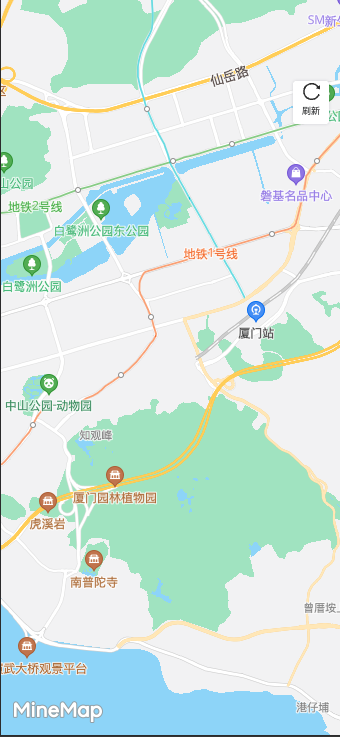

#### 地图

author: 陈书航

#### 组件路径

`@/components/ecpp/Map`

#### Props 参数

| 参数         | 说明                                           | 类型     | 默认值  | 是否必填 |
| ------------ | ---------------------------------------------- | -------- | ------- | -------- |
| width        | 宽度                                           | String   | `100%`  | 否       |
| height       | 高度                                           | String   | `100%`  | 否       |
| heigidht     | 地图的样式 id，必须唯一                        | String   | `mapId` | 否       |
| @loadSuccess | 地图渲染后会默认创建地图，地图创建成功后的方法 | Function | -       | 否       |

#### 地图提供的方法

#### 设置范围和边界(setBoundary)

> 需要设置 `aggregationColorData` 来设置对应边界的颜色

| 参数      | 说明                                                                  | 类型    | 默认值 | 是否必填 |
| --------- | --------------------------------------------------------------------- | ------- | ------ | -------- |
| list      | 可存放多个点位数组的数组，类似：`[[[xx,xx][xx,xx]],[[xx,xx][xx,xx]]]` | Array   | []     | 是       |
| key       | 对应当前 list 的总的标识                                              | String  | -      | 是       |
| show      | 是否渲染                                                              | Boolean | true   | 否       |
| paramsObj | 可自定义绘制参数，具体请细看内部方法                                  | Object  | {}     | 否       |

#### 设置文本标记(initTextPoints)

| 参数 | 说明 | 类型  | 默认值 | 是否必填 |
| ---- | ---- | ----- | ------ | -------- |
| list | 数组 | Array | []     | 是       |
| key  | 标识 | -     | -      | 是       |

#### 绘制路线(addLine)

| 参数      | 说明             | 类型    | 默认值 | 是否必填 |
| --------- | ---------------- | ------- | ------ | -------- |
| latLngArr | 数据经纬度数组   | Array   | []     | 是       |
| key       | 标识             | -       | -      | 是       |
| repaint   | 是否显示行进方向 | Boolean | false  | 否       |

#### 删除路线(delLine)

| 参数 | 说明               | 类型   | 默认值 | 是否必填 |
| ---- | ------------------ | ------ | ------ | -------- |
| key  | 删除路线对应的 key | String | -      | 否       |

#### 飞行(flyAction)

| 参数 | 说明                     | 类型   | 默认值 | 是否必填 |
| ---- | ------------------------ | ------ | ------ | -------- |
| obj  | 只需要打对象传递进来即可 | Object | {}     | 是       |

#### 点聚合(pointAggregation)

| 参数 | 说明     | 类型   | 默认值 | 是否必填 |
| ---- | -------- | ------ | ------ | -------- |
| list | 数据数组 | Array  | []     | 是       |
| key  | 标识     | String | -      | 是       |
| icon | 图标     | String | -      | 是       |

#### 清空聚合(clearAggregation)

| 参数 | 说明 | 类型   | 默认值 | 是否必填 |
| ---- | ---- | ------ | ------ | -------- |
| key  | 标识 | String | -      | 是       |
