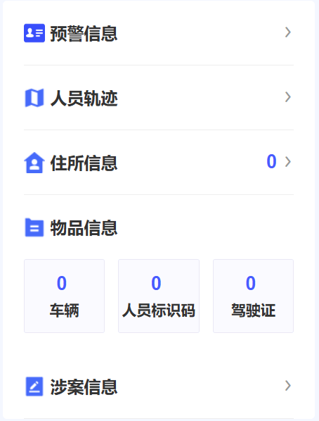

#### PersonDimension 人员维度组件
人员维度组件用于展示人员的多维度信息，包括住所、人员维度、涉案信息、轨迹和预警信息。

#### 预览效果


#### 组件路径
`@/pagesEcpp/components/PersonDimension`

#### 基础用法
```vue

<template>
  <person-dimension :detail="detail" :modules="modules" />
</template>
<script>
import PersonDimension from '@/pagesEcpp/components/PersonDimension';
export default {
  name: 'Demo',
  components: { PersonDimension },
  data() {
    return {
      detail: {
        idNumber: '310106197104200327',
        ...otherDetails
      },
      modules: ['house', 'dimension'],
    };
  },

};
</script>
```

#### API 参数

##### Props

| 参数名 | 说明 | 类型 | 默认值 | 是否必填 |
|--------|------|------|--------|----------|
| detail | 人员详细信息对象 | `Object` | `{}` | 是 |
| modules | 显示的维度模块列表 | `Object[]` | `['house', 'dimension', 'involved', 'track', 'contrast']` | 是 |

##### 类型定义

###### ModuleType
- `house`: 住所信息
- `dimension`: 人员维度
- `involved`: 涉案信息  
- `track`: 轨迹信息
- `contrast`: 预警信息
