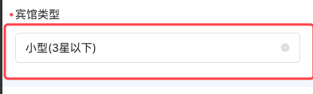

#### 选择框

#### 组件路径

> **组件已经全局注册过，无须再次引入**

`@/components/eqds/uni/uni-data-picker-search/uni-data-picker-search`

#### API

| 参数        | 说明               | 类型     | 默认值                             | 是否必填 |
| ----------- | ------------------ | -------- | ---------------------------------- | -------- |
| localdata   | 数据源             | Object[] | []                                 | 是       |
| placeholder | placeholder        | String   | 请选择                             | 否       |
| popup-title | 弹框的标题         | String   | ''                                 | 否       |
| border      | 是否展示边框       | String   | true                               | 否       |
| map         | 字段别名替换       | MapAlias | `{ text: 'text', value: 'value' }` | 否       |
| v-model     | 值                 | String   | -                                  | 是       |
| readonly    | 是否只读           | Boolean  | false                              | 否       |
| clearIcon   | 是否展示清楚的按钮 | Boolean  | true                               | 否       |
