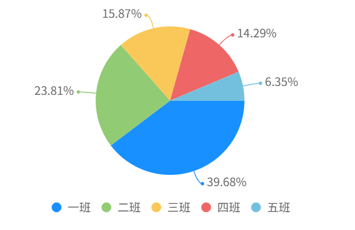

#### QiunDataCharts 图表组件

author: 孔德忠

一个功能强大、跨平台的 uni-app 图表组件。它支持丰富的图表类型和复杂的个性化配置，能够通过本地数据或 uniCloud 云数据库驱动。组件底层封装了 uCharts，并可在 H5 和 App 端选择性地使用 ECharts 以实现更高级的图表效果。

#### 预览效果



#### 组件路径

`@/pagesEcpp/components/qiun-data-charts/components/qiun-data-charts/qiun-data-charts`

#### 基础用法

```vue
<template>
  <!-- 需要为图表组件提供一个有固定宽高的父容器 -->
  <view style="width: 100%; height: 300px;">
     <qiun-data-charts 
      type="pie"
      :opts="chartOptions"
      :chartData="chartData"
    />
  </view>
</template>
<script>
// 完整组件路径请根据项目实际情况填写
import QiunDataCharts from '@/pagesEcpp/components/qiun-data-charts/components/qiun-data-charts/qiun-data-charts';

export default {
  name: 'Demo',
  components: { QiunDataCharts },
  data() {
    return {
      // 图表数据
      chartData: {...},
      // 图表配置
      chartOptions: {...}
    };
  }
};
</script>
```

#### API 参数

##### Props

| 参数名 | 说明 | 类型 | 默认值 | 是否必填 |
| --- | --- | --- | --- | --- |
| type | 图表类型，例如 `line`, `pie`, `bar` 等 | `String` | `null` | 是 |
| chartData | 图表数据，标准格式为 `{categories:[], series:[]}` | `Object` | `{}` | 否 |
| opts | uCharts 的配置选项 | `Object` | `{}` | 否 |
| eopts | ECharts 的配置选项 (仅在 H5/App 端启用时生效) | `Object` | `{}` | 否 |
| collection | uniCloud DB 集合名称 | `String` | `''` | 否 |
| field | uniCloud DB 查询字段 | `String` | `''` | 否 |
| where | uniCloud DB 查询条件 | `String` | `''` | 否 |
| loadingType | 加载状态的动画类型 (1-5) | `Number` | `2` | 否 |
| errorMessage | 自定义错误信息，传入非空值时显示错误状态 | `String` | `null` | 否 |
| background | 图表背景颜色 | `String` | `'rgba(0,0,0,0)'` | 否 |
| canvasId | 图表 canvas 的唯一标识符 | `String` | 自动生成 | 否 |
| echartsH5 | 在 H5 平台是否强制使用 ECharts | `Boolean`| `false` | 否 |
| echartsApp | 在 App 平台是否强制使用 ECharts | `Boolean`| `false` | 否 |

##### Events

| 事件名 | 说明 | 回调参数 |
| --- | --- | --- |
| getIndex | 点击图表上的数据点时触发 | 包含 `currentIndex`、`value` 等信息的对象 |
| complete | 图表渲染完成时触发 | 包含 `id` 和 `opts` 等信息的对象 |
| error | 组件出现错误时触发 | 包含错误信息的对象 |

##### Methods

| 方法名 | 说明 | 参数 |
| --- | --- | --- |
| saveImage | 保存当前图表为图片 | - |
| getImage | 获取图表的 base64 图片数据 | - |
| reloading| 手动重新加载并渲染图表 | - |

