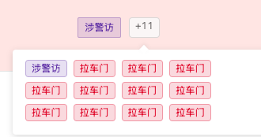

#### 多 Tag 渲染

#### 组件路径

author: 陈书航

`@/pagesEcpp/components/RgbaTag`

#### API

| 参数          | 说明                                 | 类型   | 默认值    | 是否必填 |
| ------------- | ------------------------------------ | ------ | --------- | -------- |
| list          | 数据(后端有统一的格式，他们会清楚)   | Array  | []        | 是       |
| tagNameKey    | tag 名称的别名                       | String | `tagName` | 否       |
| ellipsisCount | 只展示多少个 tag，超过的用省略号展示 | number | 9999      | 否       |
