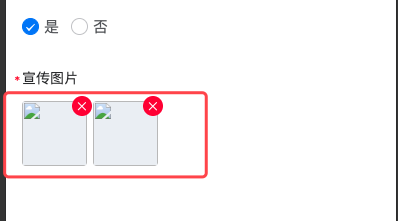

#### 多图片上传

#### 组件路径

author: 陈书航

`@/pagesEcpp/components/UploadImage`

#### API

| 参数                | 说明                      | 类型    | 默认值              | 是否必填 |
| ------------------- | ------------------------- | ------- | ------------------- | -------- |
| value               | 在线图片数据，以 `,` 分割 | String  | -                   | 是       |
| tagNameKmaxLengthey | 最多上传多少张图片        | Number  | 9                   | 否       |
| disabled            | 是否可编辑                | Boolean | false               | 否       |
| bucket              | 上传 minio 图片的桶名     | String  | `owner-information` | 否       |
