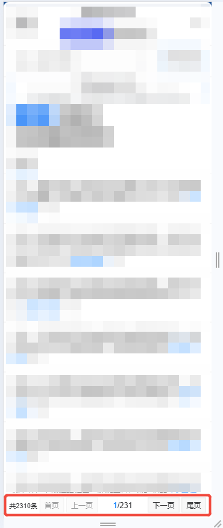

#### 分页器

author: 龚海强

`<uni-zb-pagination :current-page="totalPage.current" :total="totalPage.total" layout="total,prev,next" :page-size="totalPage.size" @current-change="handleCurrentChange" />`

#### 组件路径

> **组件已经全局注册过，无须再次引入**

`@/components/eqds/uni/uni-zb-pagination/uni-zb-pagination`

#### API

| 参数        | 说明                 | 类型   | 默认值               | 是否必填 |
| ----------- | -------------------- | ------ | -------------------- | -------- |
| total       | 总数量               | Number | 0                    | 否       |
| currentPage | 当前页数             | Number | 1                    | 否       |
| pageSize    | 每页条数             | Number | 10                   | 否       |
| prevText    | 自定义上一页按钮文本 | String | 上一页               | 否       |
| nextText    | 自定义下一页按钮文本 | String | 下一页               | 否       |
| layout      | 展示功能配置         | String | first,prev,next,last | 否       |

#### layout 展示功能配置

| 参数  | 说明                   |
| ----- | ---------------------- |
| first | 是否显示快捷跳转到首页 |
| last  | 是否显示快捷跳转到尾页 |
| prev  | 是否显示上一页按钮     |
| next  | 是否显示下一页按钮     |
| total | 是否显示总数量         |
