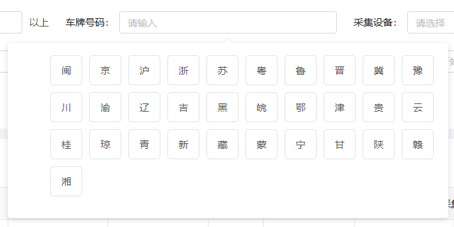

#### 车牌选择器

author: 龚海强

#### 组件路径

`@/components/jeecgbiz/JCarNoInput`

> **组件已经全局注册过，无须再次引入**

#### API

| 参数           | 说明                                | 类型    | 默认值 | 是否必填 |
| -------------- | ----------------------------------- | ------- | ------ | -------- |
| value(v-model) | 选择框内容                          | String  | -      | 否       |
| placeholder    | 选择框默认文字                      | String  | -      | 否       |
| disabled       | 是否禁用                            | boolean | false  | 否       |
| mode           | 附带刷新按钮的选择器(mode="search") | String  | -      | 否       |

#### 事件

| 参数   | 说明                                                 | 回调参数    |
| ------ | ---------------------------------------------------- | ----------- |
| change | 选择框内容变化时的回调                               | function(e) |
| search | 点击刷新或按下回车键时的回调(仅在 mode="search"生效) | function(e) |
