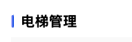

#### 通用标题

#### 组件路径

`@/components/ecpp/CardTitle`

#### API

| 参数          | 说明               | 类型     | 默认值  | 是否必填 |
| ------------- | ------------------ | -------- | ------- | -------- |
| title         | 标题               | String   | 标题    | 是       |
| background    | 背景色             | String   | #eef1f7 | 否       |
| showCloseIcon | 是否显示打叉小图标 | Boolean  | false   | 否       |
| fontWeight    | 标题权重           | Boolean  | false   | 否       |
| fontSize      | 标题文字大小       | String   | 18px    | 否       |
| @close        | 打叉小图标点击事件 | Function | -       | 否       |

#### slot

| 参数  | 说明               |
| ----- | ------------------ |
| right | 标题右侧自定义内容 |
