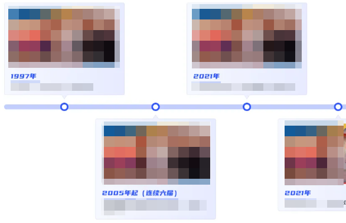

#### 横向时间轴

author: 龚海强

#### 组件路径

`@/components/ecpp/HorizontalTimeline`

#### API

| 参数    | 说明                                          | 类型    | 默认值   | 是否必填 |
| ------- | --------------------------------------------- | ------- | -------- | -------- |
| id      | 组件 id（一般配合 HorizontalScroll 组件使用） | String  | timeline | 否       |
| list    | 数据源                                        | Array   | []       | 否       |
| showImg | 是否需要展示图片                              | Boolean | false    | 否       |
| width   | 每一项的宽度                                  | String  | 400px    | 否       |
