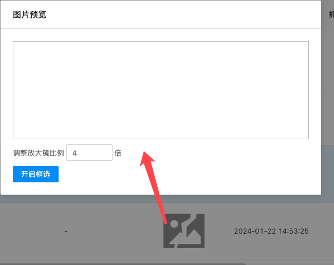

#### 图片预览

> 图片点击后支持弹框看大图，并可支持放大镜效果和框选查询对应的人员数据

#### 组件路径

`@/components/ecpp/ImgPreview`

#### API

| 参数         | 说明                                                                            | 类型     | 默认值                                  | 是否必填 |
| ------------ | ------------------------------------------------------------------------------- | -------- | --------------------------------------- | -------- |
| src          | 图片 url                                                                        | String   | -                                       | 是       |
| closable     | 弹框是否渲染关闭按钮                                                            | Boolean  | true                                    | 否       |
| title        | 弹框标题                                                                        | String   | 图片预览                                | 否       |
| showData     | 开启放大镜功能后，放大镜功能下会展示车辆信息                                    | Object   | {}                                      | 否       |
| showDataFlag | 是否展示车辆信息的内容                                                          | Boolean  | true                                    | 否       |
| errorImg     | 图片渲染失败后展示的失败图片                                                    | String   | require('@/assets/icon/error_gray.png') | 否       |
| boxFlag      | 是否开启一键框选能力                                                            | Boolean  | false                                   | 否       |
| @imgClick    | 点击图片后的回调，正常不用使用，内部会处理，除非有什么特殊的操作                | Function | -                                       | 否       |
| @imgClose    | 图片弹框关闭后的回调，正常不用使用，内部会处理，除非有什么特殊的操作            | Function | -                                       | 否       |
| @boxChange   | 图片框选-身份确认按钮点击的回调，正常不用使用，内部会处理，除非有什么特殊的操作 | Function | -                                       | 否       |
