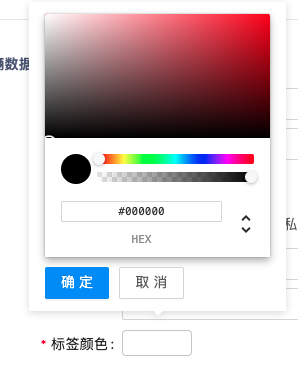

#### 颜色选择

author: 陈书航

#### 组件路径

`@/components/JColorPicker`

#### API

| 参数           | 说明                        | 类型             | 默认值 | 是否必填 |
| -------------- | --------------------------- | ---------------- | ------ | -------- |
| v-model(value) | 值                          | String \| Object | -      | 是       |
| disabled       | 是否禁用                    | Boolean          | false  | 否       |
| showColorText  | 是否展示颜色编码            | Boolean          | false  | 否       |
| showClear      | 是否允许清除数据            | Boolean          | true   | 否       |
| valueType      | 取值类型 `hex` `rgb` `rgba` | String           | hex    | 否       |
