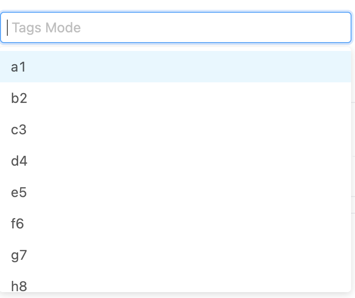

#### 下拉选择器

author: 陈书航

#### 组件路径

`@/components/dict/JDictSelectTag`

> **组件已经全局注册过，无须再次引入**

#### API

| 参数              | 说明                                               | 类型                                               | 默认值    | 是否必填 |
| ----------------- | -------------------------------------------------- | -------------------------------------------------- | --------- | -------- |
| dictCode          | 只需要传入字典或表字典，即可展示字典对应的数据值   | string                                             | -         | 否       |
| disabled          | 不可编辑                                           | Boolean                                            | false     | 否       |
| value(v-model)    | 值                                                 | String                                             | -         | 是       |
| placeholder       | placeholder                                        | String                                             | `请选择`  | 否       |
| maxTagCount       | 当场景为多选时，默认展示几个 tag                   | number                                             | 100       | 否       |
| izShowCode        | 展示 label 的格式改成 `code：label`                | Boolean                                            | false     | 否       |
| allowClear        | 是否展示清空按钮                                   | Boolean                                            | false     | 否       |
| showAll           | 是否展示全选按钮(只针对多选情况有用)               | Boolean                                            | false     | 否       |
| initList          | 如果不传递 `dictCode`， 可以传递数组，来充当数据源 | Array                                              | []        | 否       |
| mode              | 单选或者多徐昂                                     | `default` \| `multiple` `                          | `default` | 否       |
| type              | 选择器类型                                         | `select` \| `radio` \| `radioButton` \| `checkbox` | `select`  | 否       |
| getPopupContainer | 菜单渲染父节点。默认渲染到 body 上                 | Function(triggerNode)                              | -         | 否       |
| labelField        | 回显中文时的字段名                                 | String                                             | text      | 否       |
| valueField        | 回显绑定值时的字段名                               | String                                             | value     | 否       |
