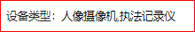

#### 根据字典获取对应中文

author: 龚海强

#### 组件路径

`@/components/jeecgbiz/JDictText`

> **组件已经全局注册过，无须再次引入**

#### API

| 参数           | 说明                                        | 类型           | 默认值 | 是否必填 |
| -------------- | ------------------------------------------- | -------------- | ------ | -------- |
| value(v-model) | 输入内容                                    | String, Number | -      | 否       |
| url            | 字典所使用的接口(该值存在时，dictCode 无效) | String         | -      | 否       |
| dictCode       | 参照的字典名                                | String         | -      | 否       |
| showCode       | 是否显示字典 code 值                        | boolean        | false  | 否       |
| code           | 匹配的字段                                  | String         | value  | 否       |
| name           | 显示的字段                                  | String         | text   | 否       |
