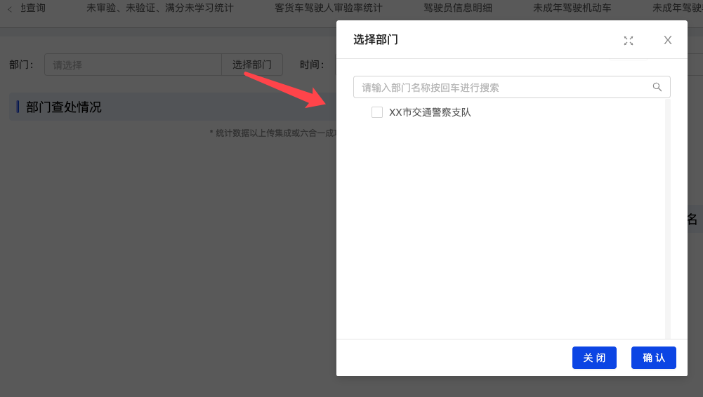

#### 部门选择器

author: 陈书航

#### 组件路径

`@/components/jeecgbiz/JSelectDepart`

> **组件已经全局注册过，无须再次引入**

#### API

| 参数               | 说明                                                 | 类型     | 默认值           | 是否必填 |
| ------------------ | ---------------------------------------------------- | -------- | ---------------- | -------- |
| modalWidth         | 弹框宽度                                             | Number   | 500              | 否       |
| checkStrictly      | 父子节点选中状态不再关联                             | Boolean  | false            | 否       |
| title              | 弹框的标题                                           | String   | `选择部门`       | 否       |
| multi              | 是否支持多选                                         | Boolean  | false            | 否       |
| rootOpened         | 是否打开第一层级的节点                               | Boolean  | true             | 否       |
| value(v-model)     | 值， 多个以 `,` 分割                                 | String   | -                | 否       |
| disabled           | 是否禁用                                             | Boolean  | false            | 否       |
| customReturnField  | 就是返回选择的 key，警务组这边有些时候是用 `orgCode` | String   | `id`             | 否       |
| backDeparInfo      | 是否返回所选部门的信息，通过 `@back` 返回            | Boolean  | false            | 否       |
| text               | 现在是界面上的字段                                   | String   | `departName`     | 否       |
| showSelectedOnly   | 选择的部门是否之展示最后一个层级                     | Boolean  | false            | 否       |
| treeOpera          | 弹框左下角支持对树操作的一些选择项                   | Boolean  | false            | 否       |
| placeholder        | placeholder                                          | String   | `请点击选择部门` | 否       |
| onlySelectMyDepart | 仅显示当前部门下的数据                               | Boolean  | false            | 否       |
| @back              | 返回所选部门的信息                                   | Function | -                | 否       |
