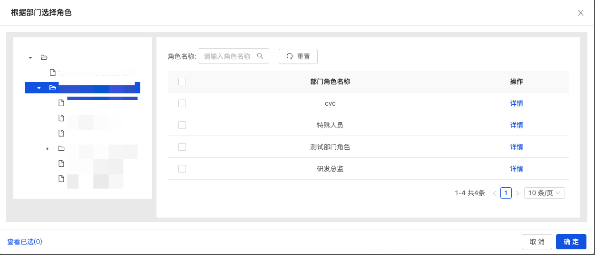

#### 角色选择器

author: 陈书航

#### 组件路径

`@/components/jeecgbiz/JSelectRoleByDep.vue`

> **组件已经全局注册过，无须再次引入**

#### API

| 参数           | 说明                                      | 类型     | 默认值           | 是否必填 |
| -------------- | ----------------------------------------- | -------- | ---------------- | -------- |
| modalWidth     | 弹框宽度                                  | Number   | 500              | 否       |
| value(v-model) | 值， 多个以 `,` 分割                      | String   | -                | 否       |
| disabled       | 是否禁用                                  | Boolean  | false            | 否       |
| multi          | 是否支持多选                              | Boolean  | false            | 否       |
| myCode         | 是否只查询自己的部门                      | Boolean  | false            | 否       |
| backUser       | 是否返回所选用户的信息，通过 `@back` 返回 | Boolean  | false            | 否       |
| placeholder    | placeholder                               | String   | `请点击选择部门` | 否       |
| customKey      | 以哪个值作为 key                          | String   | `id`             | 否       |
| @back          | 返回所选用户的信息                        | Function | -                | 否       |
