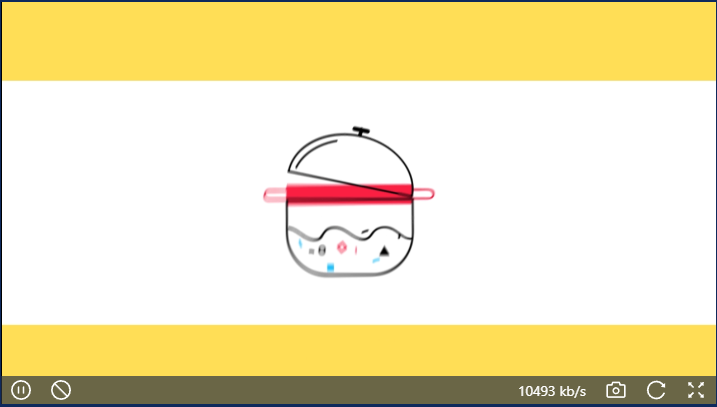

#### 视频播放器

author: 龚海强

#### 组件路径

`@/components/ecpp/VideoPlayer`

视频播放器采用的是 Jessibuca.js 和 easyplayer.js

参考文档：

Jessibuca.js：https://jessibuca.com/

easyplayer.js：`node_modules/@easydarwin/easyplayer/README.md`

#### API

| 参数     | 说明                                                  | 类型    | 默认值 | 是否必填 |
| -------- | ----------------------------------------------------- | ------- | ------ | -------- |
| width    | 视频容器宽度                                          | String  | 100%   | 否       |
| height   | 视频容器高度                                          | String  | 100%   | 否       |
| videoUrl | 视频播放地址                                          | String  | -      | 是       |
| mode     | 播放器模式（easy / jessibuca）,flv 推荐使用 jessibuca | String  | easy   | 否       |
| autoplay | 自动播放（仅在 easy 模式下可用）                      | Boolean | true   | 否       |
| hasAudio | 是否有音频（仅在 jessibuca 模式下可用）               | Boolean | true   | 否       |
