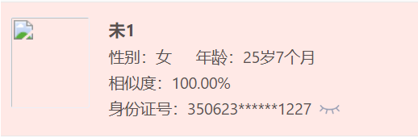

#### 人员卡片

author: 陈书航

#### 组件路径

`@/components/ecpp/PersonMsg`

#### API

| 参数          | 说明             | 类型        | 默认值 | 是否必填 |
| ------------- | ---------------- | ----------- | ------ | -------- |
| data          | 数据对象         | Object      | -      | 是       |
| alias         | 字段替换         | AliasObject | {}     | 否       |
| maxNameLength | 名字最长字段     | number      | 6      | 否       |
| showTag       | 是否展示人员标签 | boolean     | true   | 否       |

#### AliasObject 别名对象

| 参数          | 说明     |
| ------------- | -------- |
| facePic       | 图片     |
| name          | 名字     |
| age           | 年龄     |
| sex           | 性别     |
| idNumber      | 身份证   |
| tagKey        | 标签 key |
| similarityStr | 相似度   |
